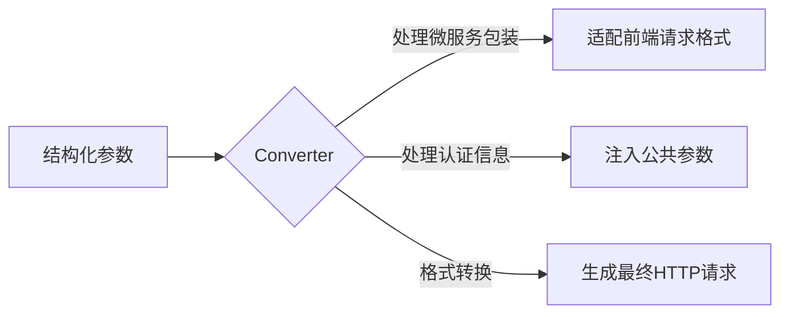
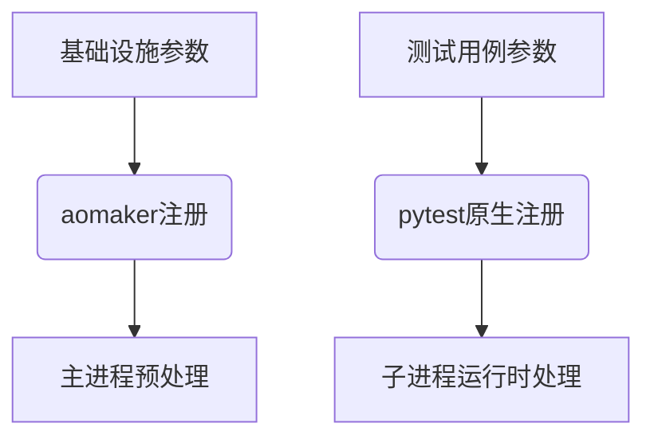

# 一、介绍
## 现状
在接口自动化测试领域，主流的自动化测试框架普遍聚焦于测试用例层面的优化：用例编排、数据驱动、断言机制等，形成了以关键字驱动、模板引擎为代表的技术路径。然而，对于企业级的**接口自动化测试**场景，真正的挑战是否仅停留在用例层？

## 困境
非也，当我们深入企业级接口自动化场景时会发现，真正的痛点并非在用例层。
以Python技术栈为例，自动化测试的核心能力（用例编排、发现/运行机制等）已由unittest/pytest等成熟框架提供，早已相对完善。
真正未被有效解决的，是高频迭代中接口维护带来的挑战：
- 接口参数随业务快速变化
- 版本迭代导致接口路径频繁修改
- 接口定义与文档脱节：人工维护代码与OpenAPI/Swagger文档一致性成本极高
- 多环境切换带来的配置管理复杂度
- 团队协作中的接口定义一致性难题
传统方案在应对这些挑战时，往往陷入"接口定义散落测试用例"、"参数维护成本指数级增长"的困境。

## 痛点
如何保证接口的高可维护性？我们先看下传统有哪些方案。
**方案一： 原始请求直连**
```python
def test_get_containers():
    response = requests.get(url="http://example.com/api/usr-xxx/containers?limit=10")
    assert response.status_code == 200
```
- **优点**：实现简单、直观，适合小型项目或快速验证。
- **缺点**：复用性极差，接口URL和参数直接硬编码在用例中。当接口数量增加或需求变更时，修改工作量巨大，维护成本随规模膨胀呈指数级上升，难以工程化，停留在“脚本”级别。

**方案二： 基础接口抽象**
```python
class BaseApi:
    host = "http://example.com"
    headers = {"Content-Type": "application/json"}

    def send_http(self, data: dict):
        try:
            response = requests.request(**data)
            return response
        except Exception as e:
            raise e

class ContainersApi(BaseApi):
    def get_containers(self, namespace, limit=10):
        url = f"{self.host}/api/{namespace}/containers?limit={limit}"
        data = {
            'url': url,
            'method': 'get',
            'headers': self.headers,
        }
        return self.send_http(data)

def test_get_containers():
    api = ContainersApi()
    response = api.get_containers(namespace="usr-xxx", limit=10)
    assert response.status_code == 200
```
- **优点**：通过类封装实现接口层与用例层的解耦，提升了复用性。
- **缺点**：接口参数和URL仍硬编码在方法中，缺乏结构化管理。当参数增多或接口逻辑复杂时，维护难度依然较高，扩展性受限。

**方案三： 接口抽象+接口参数建模**
```python
from dataclasses import dataclass

@dataclass
class GetContainersParams:
    namespace: str
    limit: int = 10

class ContainersApi(BaseApi):
    def get_containers(self, params: GetContainersParams):
        url = f"{self.host}/api/{params.namespace}/containers?limit={params.limit}"
        data = {
            'url': url,
            'method': 'get',
            'headers': self.headers,
        }
        return self.send_http(data)

def test_get_containers():
    params = GetContainersParams(namespace="usr-xxx", limit=10)
    api = ContainersApi()
    response = api.get_containers(params)
    assert response.status_code == 200
```
- **优点**：通过数据类（如dataclass）将参数与接口定义解耦，参数初步结构化，使之管理更清晰。
- **缺点**：URL和参数拼接仍需手动处理，缺乏强约束和结构化描述。接口层被抽象为接口类、定义层和数据模型层三层，调用复杂，且IDE支持有限，开发者无法直观获取参数提示。

以上三种方案体现了**APIObject**思想的逐步演进，但仍未达到理想状态，传统方案始终存在"定义碎片化"与"维护复杂度"的矛盾。
接口维护的痛点——硬编码、缺乏约束、调用复杂性——并未彻底解决。
那，有没有更优的方案？

## 解决方案
基于上述挑战，**aomaker V3**应运而生。
通过对象化建模，将接口的完整定义（URL、方法、请求头、参数、请求体、响应体等）整合为一个统一的模型，彻底革新了接口自动化测试的实现方式。
同时，aomaker V3与**OpenAPI/Swagger**深度集成，支持从**OpenAPI 3.x**和**Swagger 2.0**文档中一键生成接口定义模型，进一步简化开发流程，提升效率和准确性。

### 1.aomaker V3的核心设计

aomaker V3选择使用attrs库作为建模工具。相比dataclass的轻量但功能有限，以及pydantic的强大但过于繁重，attrs恰好平衡了两者优点：

- 简单直接，减少样板代码；
- 支持类型注解和内置验证器，同时允许灵活关闭强校验，适应接口测试中验证异常参数的需求；
- 性能优化后接近手写代码，运行高效。

> 更多`attrs` 特性可查看[官方文档](https://www.attrs.org/en/stable/why.html)。


aomaker V3基于`attrs`的声明式接口建模
接口定义示例：
```python
from attrs import define, field 

from aomaker.core.router import router
from aomaker.core.api_object import BaseAPIObject


@define(kw_only=True)  
@router.get("/api/{namespace}/containers")  
class GetContainersAPI(BaseAPIObject[ContainersResponse]):  
    """获取容器列表"""  
  
    @define  
    class PathParams:  
        namespace: str = field()  
  
    @define  
    class QueryParams:  
        offset: Optional[int] = field(default=0)  
        limit: Optional[int] = field(default=10)  
        name: Optional[str] = field(  
            default=None, metadata={"description": "容器名称, 模糊搜索"}  
        )  
        reverse: Optional[bool] = field(  
            default=True, metadata={"description": "按时间倒序排列"}  
        )  
        order_by: Optional[str] = field(  
            default="created_at", metadata={"description": "排序字段"}  
        )  
  
    path_params: PathParams  
    query_params: QueryParams = field(factory=QueryParams)  
    response: Optional[ContainersResponse] = field(  
        default=ContainersResponse  
    )

def test_notebooks_get():  
    path_params = GetContainersAPI.PathParams(namespace="usr-xxx")  
    query_param = GetContainersAPI.QueryParams(limit=100)  
    res = GetContainersAPI(path_params=path_params, query_params=query_param).send()  
    assert res.response_model.ret_code == 0
```

### 2.aomaker V3如何解决问题并带来优势

1. **高可维护性**
    - **声明式定义**：通过 @router.get 装饰器声明路由和方法，URL和请求方式不再硬编码，接口定义一目了然。
    - **结构化参数**：路径参数、查询参数、请求体和请求响应独立建模，职责清晰，便于修改和扩展。即使接口数量激增，维护成本也能保持线性增长。
2. **易用性提升**
    - **智能IDE支持**：`attrs` 带来的类型提示和自动补全功能，让开发者在调用接口时能直观看到参数定义及其约束（如默认值、描述），显著降低出错概率。
    - **调用简洁**：参数按需实例化，代码逻辑清晰，开发者无需手动拼接URL或猜测参数格式。
3. **灵活性与适配性**
    - **参数校验灵活**：attrs支持内置和自定义验证器，可按需启用校验，同时允许传入异常参数以测试后端边界场景，完美适配接口测试需求。
    - **模块化设计**：接口定义与用例分离，支持团队协作和模块复用。
4. **性能保障**
    - attrs生成的类经过优化，运行时性能接近手写代码，确保大规模测试场景下的高效执行。

### 3.与OpenAPI/Swagger深度集成：一键生成接口定义模型

aomaker V3的一大亮点是与**OpenAPI 3.x**和**Swagger 2.0**的深度集成，支持从API文档中**一键生成接口定义模型**。这一功能极大地简化了接口定义的过程，提升了开发效率和准确性，尤其适用于大型项目或API频繁更新的场景。

- **自动化生成**：开发者无需手动编写复杂的接口模型。只需导入项目的OpenAPI 3.x或Swagger 2.0文档，aomaker V3即可自动解析并生成相应的attrs模型，包含路径参数、查询参数、请求体和响应体的定义。
- **确保一致性**：自动生成的模型与API文档严格同步，确保接口定义的准确性，减少人为错误的可能性。
- **提升效率**：开发者可以快速适应接口变更，专注于业务逻辑和测试用例的编写，而无需担心接口定义的细节。
### 与传统方案的对比

|**特性**|**方案一**|**方案二**|**方案三**|**aomaker V3**|
|---|---|---|---|---|
|**接口定义方式**|硬编码|部分抽象|参数建模|声明式建模 + 自动化生成|
|**可维护性**|😞 差|😐 一般|🙂 中等|😄 高|
|**IDE支持**|🚫 无|🔧 弱|🔨 一般|🛠️ 强|
|**参数管理**|📋 无结构|🔒 硬编码|📐 结构化但弱|🏗️ 强结构化|
|**扩展性**|📉 差|📊 一般|📈 中等|🚀 高|
|**API文档集成**|❌ 无|❌ 无|❌ 无|✅ 支持OpenAPI/Swagger|

### 4.核心价值

通过aomaker V3，企业级接口自动化测试的维护难题得以破解：

- **从“脚本级”到“工程化”**：接口定义标准化，告别散乱的硬编码。
- **从“被动维护”到“主动管理”**：结构化建模与OpenAPI/Swagger集成让接口管理更主动、可控。
- **从“低效开发”到“高效协作”**：智能提示、模块化设计与一键生成模型提升开发效率，助力团队协作。

aomaker V3重新定义了接口自动化测试的工程范式，通过代码化建模+文档化驱动的双引擎，不仅解决了技术层面的维护难题，更构建起"开发-测试-文档"三位一体的协作生态，为企业级接口自动化提供真正可持续的解决方案。

---

# 二、快速开始

> aomaker提供了mock server和大量示例接口，帮助使用者理解aomaker的工程范式并快速上手。

## 1.创建脚手架
```bash
# 创建脚手架
aomaker create xxx
# 进入脚手架项目
cd xxx
```

## 2.开启mock server
```bash
aomaker mock start --web
```
可以查看接口文档


## 3.根据接口文档自动生成接口定义
> 脚手架已经带有mock接口的定义，也可以不自动生成。

接口定义会自动生成到指定目录下，该目录下会有若干个package，每个package代表一个接口类（根据接口文档中的tag对接口分类），每个接口package下会有两个模块：apis.py和models.py
- apis.py: 该类下所有接口的接口定义
- models.py: 接口定义中所有引用的模型定义，包括响应模型


执行自定生成：
```bash
aomaker gen models -s http://127.0.0.1:9999/api/aomaker-openapi.json -o apis/mock2
```

*apis.py*
```python

...
# 1. GET请求，带路径参数  
@define(kw_only=True)  
@router.get("/api/user_details/{user_id}")  
class GetUserDetailAPI(BaseAPIObject[UserDetailResponse]):  
    """获取用户详细信息"""  
  
    @define  
    class PathParams:  
        user_id: int = field(metadata={"description": "用户ID"})  
  
    path_params: PathParams  
    response: Optional[UserDetailResponse] = field(default=UserDetailResponse)  
    endpoint_id: Optional[str] = field(default="get_user_detail_api_user_details__user_id__get")  
  
  
# 2. GET请求，带查询参数  
@define(kw_only=True)  
@router.get("/api/comments")  
class GetCommentsAPI(BaseAPIObject[CommentListResponse]):  
    """获取评论列表"""  
  
    @define  
    class QueryParams:  
        product_id: Optional[int] = field(default=None, metadata={"description": "产品ID"})  
        user_id: Optional[int] = field(default=None, metadata={"description": "用户ID"})  
        min_rating: Optional[int] = field(default=None, metadata={"description": "最低评分"})  
        offset: int = field(default=0, metadata={"description": "偏移量"})  
        limit: int = field(default=10, metadata={"description": "限制数量"})  
  
    query_params: QueryParams = field(factory=QueryParams)  
    response: Optional[CommentListResponse] = field(default=CommentListResponse)  
    endpoint_id: Optional[str] = field(default="get_comments_api_comments_get")  
  
  
# 3. GET请求，无路径参数和查询参数  
@define(kw_only=True)  
@router.get("/api/system/status")  
class GetSystemStatusAPI(BaseAPIObject[SystemStatusResponse]):  
    """获取系统状态"""  
  
    response: Optional[SystemStatusResponse] = field(default=SystemStatusResponse)  
    endpoint_id: Optional[str] = field(default="get_system_status_api_system_status_get")  
  
  
# 4. POST请求，带路径参数和请求体  
@define(kw_only=True)  
@router.post("/api/products/{product_id}/comments")  
class AddProductCommentAPI(BaseAPIObject[CommentResponse]):  
    """添加产品评论"""  
  
    @define  
    class PathParams:  
        product_id: int = field(metadata={"description": "产品ID"})  
  
    @define  
    class RequestBodyModel:  
        id: int = field()  
        product_id: int = field()  
        user_id: int = field()  
        content: str = field()  
        rating: int = field()  
        created_at: datetime = field()  
  
    path_params: PathParams  
    request_body: RequestBodyModel  
    response: Optional[CommentResponse] = field(default=CommentResponse)  
    endpoint_id: Optional[str] = field(default="add_product_comment_api_products__product_id__comments_post")

...

```

*models.py*
```python
...

@define(kw_only=True)  
class Address:  
    street: str = field()  
    city: str = field()  
    province: str = field()  
    postal_code: str = field()  
    country: str = field(default="中国")  
  
  
@define(kw_only=True)  
class UserDetail:  
    user_id: int = field()  
    address: Address = field()  
    phone: str = field()  
    birth_date: Optional[datetime] = field(default=None)  
    tags: List[str] = field(factory=list)  
    preferences: Dict[str, Any] = field(factory=dict)  
  
  
@define(kw_only=True)  
class Comment:  
    id: int = field()  
    product_id: int = field()  
    user_id: int = field()  
    content: str = field()  
    rating: int = field()  
    created_at: datetime = field()
    
...

```

## 4.运行测试用例
mock测试用例在`testcase/test_mock.py`中
```python

@pytest.mark.mock_api  
def test_get_users():  
    """测试获取用户列表API"""  
    query_params = GetUsersAPI.QueryParams(limit=2)  
    res = GetUsersAPI(query_params=query_params).send()  
  
    assert res.response_model.ret_code == 0  
    assert len(res.response_model.data) <= 2  
    assert res.response_model.total >= 0  
  
  
@pytest.mark.mock_api  
def test_create_user():  
    """测试创建用户API"""  
    request_body = CreateUserAPI.RequestBodyModel(  
        id=4,  
        username="赵四",  
        email="zhaoliu@example.com",  
        created_at=datetime.now()  
    )  
  
    res = CreateUserAPI(request_body=request_body).send()  
  
    assert res.response_model.ret_code == 0  
    assert res.response_model.data.id == 4  
    assert res.response_model.data.username == "赵四"


```

运行测试用例
```bash
arun -e mock -m mock_api
```

## 6.查看aomaker live console（可选）
可以在开始运行用例前，打开该页面，可以实时查看各个子进程的用例执行进度和日志。
打开方式：
```bash
aomaker service start --web
```


---

# 三、核心用法
## 1. 编写接口定义
一个接口就是一个类。
步骤：
- 导入：
	- `from attrs import define, field`
	- `from aomaker.core.router import router`
	- `from aomaker.core.api_object import BaseAPIObject` (如果有自定义基类，导入自定义基类)
- 指定路由和请求方法： `@router.post(/api/xxx/yyy)`
- 定义接口类名（推荐以`API`结尾），继承接口基类`BaseAPIObject`，如果需要在调用接口响应时有IDE自动补全和提示，需要指定响应模型泛型类
- 一个接口类下主要有4个核心参数：
	- path_params: 路径参数，替换路由中`{}` 的内容
	- query_params: 查询参数
	- request_body: 请求体
	- response: 响应
- 各个参数模型的字段类型，也支持嵌套类
- 推荐按以下方式进行管理
```
apis/
├── xxx/            # 接口类型
│   ├── apis.py           # 该类型下所有接口对象定义
│   └── models.py         # apis.py中所有嵌套模型定义
└── ...                   # 其他接口类型
```


>[!tip] tips
>1. 四个参数也建议用`@define` 定义为模型类
>2. 除`response` 外，其它三个参数的模型推荐定义到接口类内部，因为这样在调用接口时会有友好的参数提示，且不用额外导入
>3. 不推荐手动编写，推荐根据接口文档自动生成

*example1-查询列表接口*
```python
@define(kw_only=True)  
@router.get("/api/users")  
class GetUsersAPI(BaseAPIObject[UserListResponse]):  
    """获取用户列表"""  
  
    @define  
    class QueryParams:  
        offset: int = field(default=0, metadata={"description": "偏移量"})  
        limit: int = field(default=10, metadata={"description": "限制数量"})  
        username: Optional[str] = field(  
            default=None, metadata={"description": "用户名，模糊搜索"}  
        )  
  
    query_params: QueryParams = field(factory=QueryParams)  
    response: Optional[UserListResponse] = field(default=UserListResponse)
```

*example2-详细查询接口*
```python
@define(kw_only=True)  
@router.get("/api/users/{user_id}")  
class GetUserAPI(BaseAPIObject[UserResponse]):  
    """获取单个用户信息"""  
  
    @define  
    class PathParams:  
        user_id: int = field(metadata={"description": "用户ID"})  
  
    path_params: PathParams  
    response: Optional[UserResponse] = field(default=UserResponse)
```

*example3-创建接口*
```python
@define(kw_only=True)  
@router.post("/api/users")  
class CreateUserAPI(BaseAPIObject[UserResponse]):  
    """创建新用户"""  
  
    @define  
    class RequestBodyModel:  
        id: int = field()  
        username: str = field()  
        email: str = field()  
        created_at: datetime = field()  
        is_active: bool = field(default=True)  
  
    request_body: RequestBodyModel  
    response: Optional[UserResponse] = field(default=UserResponse)
```

*example-有嵌套字段的接口*
```python
@define(kw_only=True)  
class Comment:  
    id: int = field()  
    product_id: int = field()  
    user_id: int = field()  
    content: str = field()  
    rating: int = field()  
    created_at: datetime = field()

@define(kw_only=True)  
@router.post("/api/product_details")  
class CreateProductDetailAPI(BaseAPIObject[ProductDetailResponse]):  
    """创建产品详细信息"""  
  
    @define  
    class RequestBodyModel:  
        basic_info: Product = field()  
        sales_count: int = field(default=0)  
        comments: List[Comment] = field(factory=list)  
        related_products: List[int] = field(factory=list)  
        specifications: Dict[str, Any] = field(factory=dict)  
  
    request_body: RequestBodyModel  
    response: Optional[ProductDetailResponse] = field(default=ProductDetailResponse)
```
## 2. 根据接口文档自动生成接口定义
推荐通过接口文档自动生成接口定义，`aomaker`支持遵循`Swagger2.0`和`openapi 3.x`规范的接口文档的自动转换。

## 用法：
```bash
Usage: aomaker gen models [OPTIONS]

  Generate Attrs models from an OpenAPI specification.

Options:
  -s, --spec TEXT                 OpenAPI规范文件路径（JSON/YAML/URL）
  -o, --output TEXT               代码输出目录
  -c, --class-name-strategy [operation_id|summary|tags]
                                  API Object Class name生成策略（operation_id/summary/tags）  [default: operation_id]
  -cs, --custom-strategy TEXT     自定义命名策略的Python模块路径 (例如: 'mypackage.naming.custom_function')
  -B, --base-api-class TEXT       API基类完整路径（module.ClassName格式）  [default: aomaker.core.api_object.BaseAPIObject]
  -A, --base-api-class-alias TEXT
                                  基类在生成代码中的别名
  --help                          Show this message and exit.

```

特别说明，在自动生成时，接口类名有几种命名策略：
- operation_id: （默认方式）根据接口文档中的`operation_id` 生成，如果没有，会根据其它策略生成
- summary：根据接口文档中的`summary` 生成，如果是中文，不推荐
- tags: 根据接口的`tag` ,`path` ,`method` 组合生成
如果上述策略不满足需求，可以自定义命名策略。
比如接口path是这样：
- "/api/v1/user/regist"
- "/api/v1/user/login"
我希望最后生成的类名是：`class UserRegistAPI`和`class UserLoginAPI`，那么预置的命名策略肯定满足不了，就可以新建一个模块，如`conf`目录下`naming.py`,编写如下函数：
```python
from aomaker.maker.models import Operation  
  
  
def custom_naming(path: str, method: str, operation: Operation) -> str:  
    parts = path.split('/')  
    parts = [p for p in parts if p]  
    last_two = parts[-2:]  
  
    if len(last_two) > 1:  
        first_part = last_two[0].capitalize()  
  
        last_part = last_two[1]  
        if last_part and last_part[0].islower():  # 检查是否为小驼峰（首字母小写）  
            last_part = last_part[0].upper() + last_part[1:]  
  
        camel_case = first_part + last_part  
    elif len(last_two) == 1:  
        last_part = last_two[0]  
        if last_part and last_part[0].islower():  
            camel_case = last_part[0].upper() + last_part[1:]  
        else:  
            camel_case = last_part.capitalize()  
    else:  
        camel_case = ""  
  
    return f"{camel_case}API"
```

当执行`aomaker gen models` 时，加上参数`--cs conf.naming.custom_naming` 即可。
## 生成结构
```
apis/demo/
├── notebooks/            # 按OpenAPI tag自动分包
│   ├── apis.py           # 接口对象定义
│   └── models.py         # 嵌套模型定义
└── ...                   # 其他业务模块
```

这个命令可能会随着项目迭代频繁使用，为了不每次生成时都要加这么多参数，可以在`conf/aomaker.yaml` 中将参数固化：
```yaml
openapi:  
    # OpenAPI规范文件路径  
    spec: "api-doc.json"  
    # 代码输出目录  
    output: "apis/demo"  
    # 使用预定义命名策略 (operation_id, summary, tags)    
    class_name_strategy: "operation_id"  
    # 或者使用自定义命名策略  
    custom_strategy: "conf.naming.custom_naming"  
    # API基类完整路径  
    base_api_class: "aomaker.core.api_object.BaseAPIObject"  
    # 基类在生成代码中的别名  
    base_api_class_alias: "BaseAPI"
```

## 3. 自定义接口转换器
aomaker中有一个核心组件`converter` ，它负责将接口对象转化为标准的http请求格式。
### 请求转换引擎（Converter）
#### 核心职责


在实际项目中，尤其像微服务架构中，通常会有中间层或者适配层，对前端发送的请求进行处理、转化或增强，这时可能会发现前端发出的请求（抓包）和后端原始定义的接口（接口文档）结构可能不一样。
但我们的接口定义，是完全按照接口文档来转换定义的，当我们在做系统测试或者线上巡检等测试场景时，可能更希望完全模拟用户操作，走的是前端发出的请求。
这种情况，就需要通过定制`Converter` 了。
看一个实际例子：
前端发出的请求
```python
frontend_request = {  
    "url": "https://aomaker.com/global_api/",  
    "method": "POST",  
    "headers": {"Content-Type": "application/x-www-form-urlencoded"},  
    "params": {"action": "api/containers/usr-xxxx/list"},  
    "data": {  
        "params": {  
            "limit": 10,  
            "offset": 0,  
            "action": "api/containers/usr-xxxx/list",  
            "owner": "usr-xxxx",  
            "service": "k8s"  
        },  
        "method": "GET"  
    }  
}
```

后端原始接口定义
```python
backend_request = {  
    "url": "https://aomaker.com/api/containers/usr-xxxx/list",  
    "method": "GET",  
    "params": {  
        "limit": 10,  
        "offset": 0,  
        "owner": "usr-xxxx",  
    },  
}
```

可以看到，前端的请求是经过一定规则包装过的，如果我们用直接用预置的`Converter` ，那最后发送出去的请求格式，肯定是后端的格式。

下面我们来改变转换规则。
在工程项目目录下任意位置，新建一个模块，如`apis/base.py` ：
```python
from attrs import define, field

from aomaker.core.base_model import PreparedRequest
from aomaker.core.converters import RequestConverter,ContentType


@define  
class CustomConverter(RequestConverter):

	@property  
	def common_body(self):  
	    return {  
	        "owner": config.get('user_id'),  
	        "service": "k8s"  
	    }
  
    def post_prepare(self, prepared_data: PreparedRequest) -> PreparedRequest:  
        url = f"{self.base_url}/global_api/"  
        params = {"action": self.route}  
          
        if prepared_data.request_body:  
            request_body = prepared_data.request_body.copy()  
            request_body.update(self.common_body)  
            request_body['action'] = self.route  
            new_body = {  
                "params": json.dumps(request_body),  
                "method":prepared_data.method,  
            }  
        else:  
            new_body = {  
                "params": json.dumps({"action": self.route, **self.common_body}),  
                "method": prepared_data.method,  
            }  
              
        # 4. 创建并返回新的PreparedRequest对象  
        return PreparedRequest(  
            method="POST",  
            url=url,  
            headers=prepared_data.headers,  
            params=params,  
            request_body=new_body,  
            files=prepared_data.files  
        )
```

说明：
- 自定义`Converter` 需要继承`aomaker.core.converter.RequestConverter`
- `def post_prepare(self, prepared_data: PreparedRequest) -> PreparedRequest:` 这个方法是一个父类预留的钩子方法，专门用于子类自定义实现转换逻辑的，所以它的入参和返回类型不能变。
- 只需在该方法内部自行实现转换逻辑即可

当自定义好转换逻辑后，又怎么应用到每个接口上呢？
自定义`BaseAPIObject` 并重写`converter` 属性。
*apis/base.py*
```python
from attrs import define, field

from aomaker.core.base_model import PreparedRequest
from aomaker.core.converters import RequestConverter,ContentType

from aomaker.core.apis_object import BaseAPIObject, ResponseT


@define  
class CustomConverter(RequestConverter):
	...

@define
class CustomBaseAPIObject(BaseAPIObject[ResponseT]):
	converter = field(default=CustomConverter)

```

然后，所有接口定义继承`CustomBaseAPIObject`即可。

>[!tip] tip
>在自动生成接口定义时(`aomaker gen models`) ，可以添加`--base-api-class` 参数来指定所有接口类的父类，如`--base-api-class apis.base.CustomBaseAPIObject`。

## 4.自定义http请求客户端
## 5.JsonSchema校验
针对接口响应字段复杂度高、传统断言方案存在结构性遗漏的痛点，`aomaker`采用双维度校验体系：

### 自动化结构校验（核心防御层）

- **动态Schema管理**：系统自动提取接口定义中响应体的JSON Schema结构，持久化存储至专用Schema表，当响应体发生变化时，Schema表会同步更新
- **实时结构验证**：每次请求响应后，自动触发当前响应体与历史Schema的智能比对
- **异常机制**：当检测到未注册的新字段/结构变更时，自动阻断测试流程并抛出Validation AssertionError

通过JSON Schema校验响应结构完整性，实现： 
✅ 全字段类型校验 
✅ 数据结构匹配验证 
✅ 必填字段兜底检查 
✅ 字段枚举值验证

### 业务语义校验（用户自定义层）
用户自定义核心业务断言：
✅ 关键字段值验证
✅ 业务逻辑校验
✅ 数据一致性检查
✅ 多接口数据联检

### 校验策略配置方案
默认会开启Schema校验，提供两种关闭方案：

局部关闭
```python
xxxAPI().send(enable_schema_validation=False)
```

全局关闭
```python
from aomaker.core.api_object import BaseAPIObject

class CustomBaseAPIObject(BaseAPIObject):
	"""全局禁用Schema校验的API基类"""
	enable_schema_validation: bool = field(default=False)
```

## 6.存储管理

###  设计背景

为解决多任务环境下测试变量管理难题，aomaker采用SQLite数据库作为核心存储方案。SQLite作为轻量级嵌入式数据库，具备零配置、无服务端、单文件存储等特点，完美契合测试框架对轻量化与便捷性的要求。

> SQLite是一个进程内的库，实现了自给自足的、无服务器的、零配置的、事务性的 SQL 数据库引擎。它是一个零配置的数据库，这意味着与其他数据库不一样，您不需要在系统中配置。 就像其他数据库，SQLite 引擎不是一个独立的进程，可以按应用程序需求进行静态或动态连接。SQLite 直接访问其存储文件。

### 核心架构

项目初始化时自动创建`aomaker.db`数据库文件，内置四张功能明确的表结构：

| 表名             | 生命周期  | 存储内容              | 线程安全 | 典型应用场景        |
| -------------- | ----- | ----------------- | ---- | ------------- |
| **config**     | 持久化存储 | 全局配置参数            | ✅    | 环境host/账号信息等  |
| **cache**      | 会话级存储 | 临时变量/依赖数据         | ✅    | 接口依赖参数传递，临时变量 |
| **schema**     | 持久化存储 | 接口响应模型JSON Schema | -    | 响应结构验证        |
| **statistics** | 持久化存储 | 接口元数据统计           | -    | 测试平台数据可视化     |

*表结构*


### 核心功能详解
#### 1. 全局配置管理 (config)

**存储机制**

- 自动加载`config.yaml`配置到数据库
- 支持多环境配置切换（test/release）
- 配置变更自动同步更新

**典型用法**

```yaml
# 配置文件示例（conf/config.yaml）
env: test
test:
  host: http://test.aomaker.com
  account: 
    user: aomaker002
    pwd: 123456
```

```python
# 代码调用示例
from aomaker.storage import config

def test_env_config():
    current_env = config.get("env")  # 获取当前环境
    test_host = config.get("host")  # 获取对应环境host
```

#### 2. 会话缓存管理 (cache)

**特性**
- 线程安全读写
- Worker进程隔离存储
- 支持任意数据类型存储
- 测试结束后自动清空

**使用场景**
```python
from aomaker.cache import cache

def setup():
    cache.set("auth_token", "Bearer xxxxx")  # 设置鉴权令牌

def test_api_call():
    headers = {"Authorization": cache.get("auth_token")}  # 获取缓存令牌
```

#### 3. Schema自动化管理 (schema)

**运作机制**
- 自动解析接口响应模型
- 生成标准化JSON Schema
- 支持响应结构验证

**案例演示**
例如某个接口的响应模型为`UserResponse`：
```python

@define(kw_only=True)  
class GenericResponse:  
    ret_code: int = field(default=0)  
    message: str = field(default="success")
    
@define(kw_only=True)  
class User:  
    id: int = field()  
    username: str = field()  
    email: str = field()  
    created_at: datetime = field()  
    is_active: bool = field(default=True)
    
@define(kw_only=True)  
class UserResponse(GenericResponse):  
    data: Optional[User] = field(default=None)
    
```

那`UserResponse` 模型对应的JsonSchema为：
```json
{  
  "title": "UserResponse",  
  "type": "object",  
  "properties": {  
    "ret_code": {  
      "type": "integer"  
    },  
    "message": {  
      "type": "string"  
    },  
    "data": {  
      "anyOf": [  
        {  
          "title": "User",  
          "type": "object",  
          "properties": {  
            "id": {  
              "type": "integer"  
            },  
            "username": {  
              "type": "string"  
            },  
            "email": {  
              "type": "string"  
            },  
            "created_at": {  
              "type": "string",  
              "format": "date-time"  
            },  
            "is_active": {  
              "type": "boolean"  
            }  
          },  
          "required": [  
            "id",  
            "username",  
            "email",  
            "created_at"  
          ]  
        },  
        {  
          "type": "null"  
        }  
      ]  
    }  
  },  
  "required": []  
}
```

最终每个响应模型对应的JsonSchema会自动生成并自动存到`schema` 表中：


> JSON Schema是基于JSON格式，用于定义JSON数据结构以及校验JSON数据内容。
>  JSON Schema官网地址：[http://json-schema.org/](https://link.zhihu.com/?target=http%3A//json-schema.org/)

#### 4.statics
存储所有接口的类名和包名信息。


## 7.鉴权管理
### 1.登录认证配置
在`login.py`中实现认证逻辑，框架通过继承机制自动注入环境配置：
```python
from aomaker.fixture import BaseLogin

class Login(BaseLogin):
    """登录认证基类（自动继承环境配置）"""
    
    def login(self) -> dict:
        """执行登录并返回认证响应"""
        # 内置环境变量调用：
        # 访问基础地址：self.base_url
        # 获取账户信息：self.account
        # 获取自定义配置：self.env_vars.current_env_conf.get("your_key")
        
        resp_login = auth_service.login(
            base_url=self.base_url,
            username=self.account["user"],
            password=self.account["pwd"]
        )
        return resp_login

    def make_headers(self, resp_login: dict) -> dict:
        """构建全局请求头"""
        return {
            "Authorization": f"Bearer {resp_login['token']}",
            "X-Client-Type": "auto_test"
        }

```

> 框架特性：
> 登录操作仅在会话开始时执行一次，自动将`make_headers`返回的请求头附加到整个request session。

### 2.请求头动态管控
#### 场景1：单次请求头覆盖

```python
# 正常请求携带鉴权头
UserAPI().get_profile()  # headers: Authorization

# 特殊请求覆盖头（如测试无鉴权场景）
UserAPI().send(
    headers={"X-Custom": "value"}, 
    override_headers=True
)  # 最终headers只有X-Custom
```

#### 场景2：作用域级头管理
```python
from aomaker.core.http_client import get_http_client
# 测试用例：验证接口头校验逻辑
def test_header_validation():
	default_http_client = get_http_client()
    with default_http_client.header_override_scope({"X-Test": "123"}):
        # 该作用域内所有请求使用新头
        UserAPI().get_profile()  # headers: X-Test
        OrderAPI().list()       # headers: X-Test
        
    # 作用域外恢复原头
    UserAPI().get_profile()  # headers: Authorization
```

#### 场景3： 全局请求头变更
todo。。

>[!info] 模式说明：
>- `override=True`：完全替换请求头
>- `override=False`：智能合并头字段（冲突时局部优先）
>- `with default_http_client.header_override_scope` 作用域退出后自动执行头部状态回滚


## 8.注册自定义CLI参数
aomaker提供的`@command`装饰器是对pytest原生cli参数注册机制的**增强扩展**，两者可协同工作且不存在兼容冲突。本方案重点解决多进程场景下的参数处理时序问题，并提供更简洁的声明式开发体验。
### 核心差异对比

| 维度         | pytest原生方案  | aomaker增强方案 |
| ---------- | ----------- | ----------- |
| **执行时机**   | 子进程/线程内触发   | 主进程全局预处理    |
| **配置可见性**  | 多进程场景存在同步风险 | 全局单次配置确保一致性 |
| **开发范式**   | 声明/处理逻辑分离   | 声明处理一体化     |
| **作用域**    | 测试会话级别      | 框架生命周期级别    |
| **典型应用场景** | 测试用例级参数     | 全局基础设施配置    |

#### 原生实现方式（pytest）

```python
# conftest.py
import pytest

# 1.参数声明（与处理逻辑分离）
def pytest_addoption(parser):
    parser.addoption("--zone", 
                     help="指定部署地域",
                     type=str,
                     default="cn-east-1")

# 2.单独定义处理函数
@pytest.fixture(scope="session", autouse=True)
def setup_zone(request):
    zone = request.config.getoption("--zone")
    config.set("zone", zone)  # 多进程场景可能不同步

```

潜在问题：
- 声明与实现分离增加维护成本
- 会话级作用域在多进程模式下存在时序风险
- 类型转换需手动处理

#### 增强实现方式（aomaker）

```python
# hooks.py
from aomaker.aomaker import command

@command(
    "--zone", 
    help="指定部署地域",
    type=str,
    default="cn-east-1",
    show_default=True
)
def configure_zone(zone: str):
    """全局地域配置（主进程预处理）"""
    config.set("zone", zone)  # 多进程环境下安全同步
    init_cloud_service(zone)  # 执行关联初始化操作

```

**框架优势**：

1. 声明处理一体化：装饰器同时完成参数注册与回调绑定
2. 智能类型转换：自动根据type参数转换输入值
3. 安全作用域：主进程预处理保障多任务环境一致性
4. 自文档化：help信息自动整合到CLI帮助系统

#### 装饰器参数详解

| 参数名            | 类型   | 默认值   | 说明                         |
| -------------- | ---- | ----- | -------------------------- |
| `help`         | str  | 无     | 参数说明文档（显示在help命令中）         |
| `required`     | bool | False | 是否强制要求传参                   |
| `default`      | Any  | None  | 参数默认值（required=True时不应设置）  |
| `show_default` | bool | False | 是否在帮助信息中展示默认值              |
| `type`         | type | str   | 输入值类型转换（支持int/float/json等） |
| `multiple`     | bool | False | 是否允许多次传参（值存储为列表）           |
| `action_store` | bool | False | 启用标记模式（传递即置True，适合开关型参数）   |
#### 混合使用建议


> 最佳实践：
> 
> - 全局配置参数使用aomaker注册
> - 测试用例特有参数（如数据标记、用例过滤）使用pytest原生方案
> - 需要通过`request.config.getoption`在用例中动态获取的参数建议使用pytest方案

## 9.并行运行测试用例
`aomaker` 提供了**多线程**和**多进程**两种方式以加速用例执行效率，并支持三种粒度的任务分配模式。
同时，在多线程模式下对 `allure` 报告进行了优化，避免了类似 `pytest-parallel` 可能出现的报告生成异常问题。
### aomaker 运行流程


启动后，执行流程如下：

1. 读取并加载 `config.yaml` 配置文件。
2. 执行 `hooks.py` 中定义的自定义 CLI 命令和 hook（若存在）。
3. 根据 CLI 参数指定的多任务模式（线程或进程）及分配模式，启动相应的子任务。（若在 `aomaker.yaml` 中定义了 worker 策略，则按照该策略执行）
4. 在子线程或子进程中启动 `pytest` 运行用例。
5. 所有子任务完成后，进行报告收集、聚合及环境清理，结束运行。

### 多线程

#### 启动方式

提供两种启动方式：**CLI** 和 **run.py**。

1. CLI启动

```shell
arun --mt --dist-xxx xxx
# 或
aomaker run --mt --dist-xxx xxx
```

CLI参数说明：
```css
--mt, --multi-thread     指定多线程模式
--dist-mark              按标记(mark)分配任务
--dist-file              按测试模块分配任务
--dist-suite             按测试套件分配任务
```

2. run.py启动

_run.py_

```python
from aomaker.cli import main_run  
  
if __name__ == '__main__':  
    main_run(env="mock", mt=True, d_mark="mock_api1 mock_api2 mock_api3")
```


#### 任务分配模式（从细粒度到粗粒度）

1. 按标记(mark)分配
按照 pytest 的 `mark` 功能为子线程分配任务。

- CLI示例：
```shell
arun --mt --dist-mark demo1 demo2 demo3
```
- run.py 示例:
```python
    main_run(mt=True, d_mark="demo1 demo2 demo3")
```

注意：

- 每个标记下的用例必须相互独立。
- 提供多少个标记，即开启多少个线程。

2. 按测试模块分配
即按照测试文件来分配任务给子线程，比如在`testcases\test_api`目录下有`test_demo1.py`、`test_demo2.py`、`test_demo3.py`三个测试模块，比如希望这三个模块下的测试case分别由三个子线程接管执行。

- CLI示例：
```shell
arun --mt --dist-file testcases\test_api
```
- run.py 示例:
```python
main_run(env="mock", mt=True, d_file="testcases\test_api")
```

注意：

- 每个测试模块内的用例必须相互独立。
- 指定目录下测试模块的数量即为开启线程数。


3. 按测试套件分配
即按照测试目录来分配任务给子线程，比如在`testcases\test_scenario`目录下，有`test_scenario1`、`test_scenario2`、`test_scenario3`等三个测试目录，每个目录下还有若干测试模块，比如希望这三个目录下的所有测试case分别由三个子线程接管执行。

- CLI示例：
```shell
arun --mt --dist-suite testcases\test_scenario
```
- run.py 示例:
```python
main_run(env="mock", mt=True, d_suite="testcases\test_scenario")
```

注意：

- 每个测试套件内的用例必须相互独立。
- 指定目录下测试套件的数量即为开启线程数。

### 多进程

`aomaker`目前暂时不支持在windows上创建多进程，linux、mac是完美支持的。

#### 启动方式

提供两种启动方式：**CLI** 和 **run.py**。

1. CLI启动

```shell
arun --mp --dist-xxx xxx
# 或
aomaker run --mp --dist-xxx xxx
```


2. run.py启动

```python
from aomaker.cli import main_run  
  
if __name__ == '__main__':  
    main_run(env="mock", mp=True, d_mark="mock_api1 mock_api2 mock_api3")
```

#### 分配模式

与多线程模式一致，区别仅在于任务分配给子进程。

注意：
在多进程模式下，默认最大子进程数为当前系统可用CPU核心数，可以通过`-p` 参数指定核心数，如果任务数量超过指定核心数，任务将会进行排队。

### worker策略分配配置（推荐大规模用例场景）
当测试工程较大且需并行多个标记时，CLI 命令可能过长。因此，`aomaker` 自 v2.3.0 起支持通过配置文件定义多任务分配策略。

#### 策略配置文件示例
在 `conf/dist_strategy.yaml` 中配置：
```yaml
target: ['iaas', 'hpc']
marks:
  iaas:
    - iaas_image
    - iaas_volume
  hpc:
    - hpc_sw
    - hpc_fs

```
参数说明：

- `target`: 指定要执行的策略目标。
- `marks`: 定义标签分类，每个分类下包含具体的测试标签。

例如，上述配置将产生4个标签（iaas_image、iaas_volume、hpc_sw、hpc_fs），并分配给4个 worker 并行执行。

#### 多策略配置示例

有时候，我们可能有不同的测试场景，需要跑不同的用例，即不同的标签，又不想每次重新配置。所以在此基础上，还支持**多策略配置，**具体用法如下：

_conf/dist_strategy.yaml_

```
target: ['iaas.smoke','hpc']
marks:
  iaas:
    smoke:
      - iaas_image
      - iaas_volume
    p2:
      - iaas_image_p2
      - iaas_volume_p2
      - iaas_network_p2
 
  hpc:
    - hpc_sw
    - hpc_fs
    
```

- 执行 iaas 冒烟测试时，设置 `target: ['iaas.smoke']`；
- 执行 iaas P2 测试时，设置 `target: ['iaas.p2']`；
- 若设置 `target: ['iaas.p2', 'hpc']`，则产生5个标签并分配给5个 worker 并行执行。

#### 使用策略配置启动

当使用策略配置时，CLI 启动变为：

- 多进程：`arun --mp`
- 多线程：`arun --mt`

> 注意：
> -  若不指定具体分配模式参数，则默认使用策略配置文件进行任务分配；
> -  若指定了具体分配模式参数，则优先使用指定参数进行任务分配。

## 10.注册全局钩子函数
虽然pytest已经提供了丰富且强大的hook注册机制，为什么aomaker仍要设计自己的hook机制呢？

原因与@command类似，aomaker设计的hook机制并非简单的重复造轮子，而是对pytest在多任务模式下的一种功能补充。

在aomaker的多任务模式下，pytest注册的session级别hook函数仅会在子进程或子线程中执行，而无法在主进程或主线程中生效。
而aomaker注册的hook函数则恰好解决了这个问题：
它会在主进程或主线程中执行，并且其执行顺序是在pytest hook之前。

通过使用aomaker的@hook装饰器，用户可以在主进程或主线程内自定义各类启动前配置，随后再交由pytest使用。

示例用法（hooks.py）：

```python
from aomaker.aomaker import hook

@hook
def echo_hello():
    print("echo hello~~~~~")
```

上述hook函数在注册后，将在aomaker的配置初始化阶段自动调用，即pytest启动之前。

## 11.注册自定义请求中间件
### 作用
AOMaker 中间件系统提供了一种灵活的方式来扩展和定制请求处理流程，允许在发送请求前和接收响应后执行自定义逻辑，例如日志记录、请求修改、响应验证等。

中间件是一个接收请求和下一个处理函数的可调用对象：
```python
from aomaker.core.middlewares.registry import middleware,RequestType, CallNext, registry


def my_middleware(request: RequestType, call_next: CallNext) -> ResponseType:

# 请求处理前的逻辑

response = call_next(request) # 调用下一个中间件或发送请求

# 响应处理后的逻辑

return response
```

### 中间件注册位置
自定义中间件应在项目脚手架的 middlewares 目录下创建：
```
project/
├── middlewares/           # 中间件目录
│   ├── __init__.py        # 保持空文件或导入中间件
│   ├── retry_middleware.py           # 自定义重试中间件
│   ├── mock_middleware.py            # 自定义模拟响应中间件
│   └── middleware.yaml    # 中间件配置文件
```
当启动`aomaker run` 后，系统会自动扫描该目录加载所有中间件。

### 中间件配置和控制
####  配置文件结构
通过 `middlewares/middleware.yaml` 配置文件控制中间件行为：
```yaml
# 中间件名称作为键
logging_middleware:
  enabled: true            # 是否启用
  priority: 900            # 优先级，数值越大越先执行

retry_middleware:
  enabled: true
  priority: 800
  options: #
    max_retries: 3
    retry_delay: 1.0
    retry_on_status_codes: [500, 502, 503]
```

注意📢：配置文件中的参数优先级会高于装饰器参数，比如装饰器中`enabled=True` ，但配置文件中为False，那么会以配置文件为准，不会执行这个中间件。
#### 配置参数说明

| 参数       | 类型  | 说明             |
| -------- | --- | -------------- |
| enabled  | 布尔值 | 控制中间件是否启用      |
| priority | 整数  | 执行优先级，数值越大越先执行 |
| options  | 对象  | 中间件特定配置项，可自定义  |
### 编写自定义中间件
#### 基本结构
```python
# middlewares/my_middleware.py
from aomaker.core.middlewares.registry import middleware, RequestType, CallNext, ResponseType

@middleware(
    name="my_middleware",     # 中间件名称，配置文件中使用
    enabled=True,             # 默认是否启用
    priority=500,             # 默认优先级
    log_level="INFO"          # 自定义选项示例
)
def my_middleware(request: RequestType, call_next: CallNext) -> ResponseType:
    """自定义中间件功能描述"""
    
    # 1. 请求前处理
    print(f"处理请求: {request.get('url')}")
    
    # 2. 调用下一个中间件
    response = call_next(request)
    
    # 3. 响应后处理
    print(f"收到响应: {response.status_code}")
    
    return response
```

#### 中间件装饰器参数

| 参数       | 类型  | 说明             |
| -------- | --- | -------------- |
| name     | 字符串 | 中间件名称，用于配置文件引用 |
| enabled  | 布尔值 | 默认是否启用         |
| priority | 整数  | 默认优先级          |
| options  | 字典  | 其他自定义选项        |
### 内置中间件使用说明
AOMaker 内置了结构化日志中间件 `logging_middleware`，用于记录请求和响应信息。
#### 开启/关闭方法

在 middleware.yaml 中配置：
```yaml
logging_middleware:
  enabled: true  # 设为 false 可关闭日志记录
  priority: 900
```

### 使用场景示例
#### 示例一：模拟响应中间件
当我们希望拦截某些接口，对响应做修改，就可以利用中间件来处理。
比如，我们想拦截url中带有"products"的接口，让它返回自定义的mock响应。

```yaml
# 框架自带的中间件配置
logging_middleware:
  enabled: true
  priority: 900

mock:
  priority: 800
  enabled: true
  options:
    rules:
      - "products"
```

```python
import json
import re
import requests

from aomaker.core.middlewares.registry import registry,RequestType,CallNext,middleware, ResponseType
from aomaker.core.base_model import CachedResponse
    
@middleware(name="mock", priority=800, enabled=True, options={"rules":[]})
def mock_middleware(request: RequestType, call_next: CallNext):
    """接口模拟中间件"""
    config = registry.middleware_configs["mock"].options
    mock_rules = config.get("rules", [])
    
    # 检查是否匹配模拟规则
    url = request.get("url", "")
    for rule in mock_rules:
        if rule in url:
            # 创建模拟响应
            mock_resp = requests.Response()
            mock_resp.status_code = 200
            
            # 根据URL确定返回不同的模拟数据
            if "products" in url:
                # 确保模拟数据结构与ProductResponse模型匹配
                mock_resp._content = json.dumps({
                    "ret_code": 0, 
                    "message": "success",
                    "data": {
                        "id": 1, 
                        "name": "模拟产品",
                        "price": 99.99,
                        "stock": 100,
                        "category": "测试类别"
                    }
                }).encode()
            else:
                # 其他API的模拟数据
                mock_resp._content = json.dumps({
                    "ret_code": 0, 
                    "message": "success",
                    "data": {"mock": True}
                }).encode()
                
            mock_resp.headers["Content-Type"] = "application/json"
            
            print(f"已模拟响应: {url}")
            return CachedResponse(mock_resp)
    
    # 无匹配规则，继续实际请求
    return call_next(request)

```

当进行请求后，url中有路由products的接口的响应将会被替换为mock响应


#### 示例二：性能统计中间件

```python
import time

from aomaker.core.middlewares.registry import registry,RequestType,CallNext,middleware, ResponseType


@middleware(name="performance", priority=700, options={"slow_threshold": 1.0})
def performance_middleware(request: RequestType, call_next: CallNext):
    """请求性能统计中间件"""
    # 记录开始时间
    start_time = time.time() 
    # 执行请求
    response = call_next(request)
    # 计算耗时
    duration = time.time() - start_time
    # 记录性能数据
    url = request.get("url", "").split("?")[0]  # 移除查询参数
    method = request.get("method", "GET")
    status = response.status_code
    
    print(f"性能统计 - {method} {url}: {duration:.3f}秒, 状态码: {status}")
    
    # 如果配置了性能阈值，可以记录慢请求
    config = registry.middleware_configs["performance"].options
    threshold = config.get("slow_threshold")
    if duration > threshold:
        print(f"⚠️ 检测到慢请求: {method} {url} 耗时 {duration:.3f}秒")
    
    return response
```

```yaml
# 框架自带的中间件配置
logging_middleware:
  enabled: true
  priority: 900

performance:
  priority: 700
  enabled: true
  options:
    slow_threshold: 1.0
    ```

作用： 当接口响应时间慢于{slow_threshold}时（示例中为1.0 s），进行上报


## 12.HTTP流式响应
`aomaker`支持流式响应处理，适用于大量数据传输、实时数据获取等场景。
下面介绍流式响应的使用方法。
### 基本流程

流式响应处理流程包括：
1. 发送流式请求
2. 接收流式响应
3. 处理流数据

### 基础流式请求
```python
from attrs import define, field
from aomaker.core.api_object import BaseAPIObject


@define(kw_only=True)
@router.post("/v1/chat/completions")
class StreamChatAPI(BaseAPIObject):
	
	@define
	class RequestBodyModel:
		messages: List[Dict]
		model: str = field(default="gpt-3.5-turbo")
	request_body: RequestBodyModel
		


messages = [{"role": "user", "content": "讲个故事"}]
request_body = StreamChatAPI.RequestBodyModel(messages=messages)
api = StreamChatAPI(request_body=request_body)

# 发送请求，并通过stream=True指定获取流式响应
response = api.send(stream=True)

# 处理流式响应
def process_chunk(chunk):
    print(f"收到数据: {chunk}")

# 使用行模式处理流
response.process_stream(
    stream_mode="lines",
    callback=process_chunk
)
```

### JSON流处理示例
```python
# JSON流处理
def handle_json_chunk(json_data):
    if "choices" in json_data:
        content = json_data["choices"][0]["delta"].get("content", "")
        if content:
            print(content, end="", flush=True)

# 发送请求
response = api.send(stream=True)

# 处理JSON流
response.process_stream(
    stream_mode="json",
    callback=handle_json_chunk
)
```
### 原始流处理示例
```python
# 原始流处理
def handle_raw_chunk(chunk):
    # 自行解析二进制数据
    print(f"原始数据块大小: {len(chunk)} 字节")
    # 处理二进制数据...

response = api.send(stream=True)
response.process_stream(
    callback=handle_raw_chunk
)
```

### 流式响应的三种模式

1. 原始流模式：直接处理原始二进制数据块

2. 行模式：按行处理文本数据，适用于行分隔的数据流

3. JSON模式：处理JSON格式的数据流，每个数据块解析为JSON对象

根据实际需求选择合适的处理模式，通过回调函数处理流式数据。

## 13.aomaker dashboard
在并行运行用例的情况下，想看到每个子进程/线程的测试进度，可以通过`aomaker dashboard` 查看，该面板提供：
- 当前测试的环境配置信息
- 当前测试的总体进度，子进程/线程进度
- 当前测试的实时日志信息
打开方式:
```bash
aomaker service start --web
```

参数说明：
- `--web` : 打开dashboard页面
- `--port`: 指定服务端口号，默认8888

## 14.aomaker mock-server
aomaker的mock服务，内置了大量mock接口，用于使用者快速上手掌握框架工程范式。

打开方式：

```Bash
aomaker mock start 
```

参数说明：
- `--web` : 打开接口文档页面
- `--port`: 指定服务端口号，默认9999
## 15.接口信息静态统计
如果你想统计当前项目中有多少接口，每个接口的位置，`aomaker` 提供命令进行收集统计到`statistics` 表中。
比如要统计`apis/mock2` 下的所有接口信息：
```bash
aomaker gen stats --api-dir apis/mock2 
```

在`aomaker.db` 中的`statistics` 表中可以查看：


也可以通过命令`aomaker show stats` 查看。

## 16.aomaker接入测试平台
`aomaker` 可以以服务的形式对接测试平台，通过`aomaker service start` 启动服务，并暴露如下接口：
HTTP:
- `/config/{param}`-GET : `/config/current` 获取当前环境配置信息，`/config` 获取配置文件全部配置信息
- `/stats`-GET： 获取静态接口统计信息
- `/stats/count`-GET：获取静态接口统计数量
- `/summary`-GET： 获取测试报告统计，包括：
	- 成功率
	- 失败率
	- 跳过率
	- 阻塞率
	- 用例总数
	- 通过数量
	- 失败数量
	- 跳过数量
	- 阻塞数量
	- 用例执行耗时
	- 测试任务执行开始时间
	- 测试任务结束时间
- `/progress`-GET： 用例进度时间

WebSocket:
- `/ws/logs`： 运行实时日志
- `/ws/progress`： 运行实时进度

## 17.如何debug
入口：`run.py` 

## 18.查看测试报告


---


---

### 响应智能校验体系
```python
response = notebooks_api(...).send()

# 第一层校验 - 自动schema验证
assert response.raw.status_code == 200  # HTTP状态码
# 自动触发JSON Schema验证（基于OpenAPI生成）

# 第二层校验 - 业务断言
assert response.model.ret_code == 0     # IDE智能提示模型属性
assert len(response.model.items) > 0    # 直接访问结构化数据


#### 校验能力矩阵
| 校验类型      | 触发方式      | 错误定位         | 典型场景           |
|---------------|-------------|------------------|--------------------|
| Schema校验    | 自动执行      | 精确到字段路径    | 接口契约保障       |
| 业务状态码     | 手动断言     | 整条响应层级      | 流程正确性验证     |
| 数据完整性     | 属性访问     | IDE类型提示       | 数据消费场景       |


### 鉴权管理
#### 场景1：单个请求完全覆盖头


```python
# 正常请求携带鉴权头
UserAPI().get_profile()  # headers: Authorization

# 特殊请求覆盖头（如测试无鉴权场景）
UserAPI().send(
    headers={"X-Custom": "value"}, 
    override_headers=True
)  # 最终headers只有X-Custom
```

#### 场景2：测试用例级头覆盖


```python

# 测试用例：验证接口头校验逻辑
def test_header_validation():
    with default_http_client.header_override_scope({"X-Test": "123"}):
        # 该作用域内所有请求使用新头
        UserAPI().get_profile()  # headers: X-Test
        OrderAPI().list()       # headers: X-Test
        
    # 作用域外恢复原头
    UserAPI().get_profile()  # headers: Authorization
```

#### 场景3：并行测试不同头配置


```python
# 创建独立客户端（推荐方案）
client_a = HTTPClient()
client_a.session.headers.update({"Auth": "TokenA"})

client_b = HTTPClient()
client_b.session.headers.update({"Auth": "TokenB"})

# 并行使用
UserAPI(http_client=client_a).get_profile()  # 使用TokenA
UserAPI(http_client=client_b).get_profile()  # 使用TokenB
```
