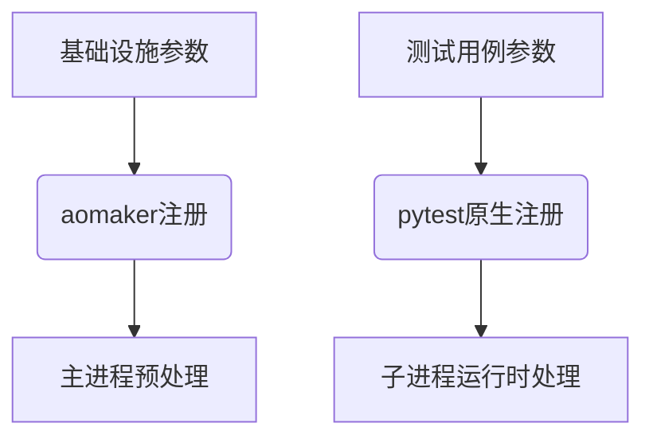

## 注册自定义CLI参数
aomaker提供的`@command`装饰器是对pytest原生cli参数注册机制的**增强扩展**，两者可协同工作且不存在兼容冲突。本方案重点解决多进程场景下的参数处理时序问题，并提供更简洁的声明式开发体验。
### 核心差异对比

| 维度         | pytest原生方案  | aomaker增强方案 |
| ---------- | ----------- | ----------- |
| **执行时机**   | 子进程/线程内触发   | 主进程全局预处理    |
| **配置可见性**  | 多进程场景存在同步风险 | 全局单次配置确保一致性 |
| **开发范式**   | 声明/处理逻辑分离   | 声明处理一体化     |
| **作用域**    | 测试会话级别      | 框架生命周期级别    |
| **典型应用场景** | 测试用例级参数     | 全局基础设施配置    |

#### 原生实现方式（pytest）

```python
# conftest.py
import pytest

# 1.参数声明（与处理逻辑分离）
def pytest_addoption(parser):
    parser.addoption("--zone", 
                     help="指定部署地域",
                     type=str,
                     default="cn-east-1")

# 2.单独定义处理函数
@pytest.fixture(scope="session", autouse=True)
def setup_zone(request):
    zone = request.config.getoption("--zone")
    config.set("zone", zone)  # 多进程场景可能不同步

```

潜在问题：
- 声明与实现分离增加维护成本
- 会话级作用域在多进程模式下存在时序风险
- 类型转换需手动处理

#### 增强实现方式（aomaker）

```python
# hooks.py
from aomaker.aomaker import command

@command(
    "--zone", 
    help="指定部署地域",
    type=str,
    default="cn-east-1",
    show_default=True
)
def configure_zone(zone: str):
    """全局地域配置（主进程预处理）"""
    config.set("zone", zone)  # 多进程环境下安全同步
    init_cloud_service(zone)  # 执行关联初始化操作

```

**框架优势**：

1. 声明处理一体化：装饰器同时完成参数注册与回调绑定
2. 智能类型转换：自动根据type参数转换输入值
3. 安全作用域：主进程预处理保障多任务环境一致性
4. 自文档化：help信息自动整合到CLI帮助系统

#### 装饰器参数详解

| 参数名            | 类型   | 默认值   | 说明                         |
| -------------- | ---- | ----- | -------------------------- |
| `help`         | str  | 无     | 参数说明文档（显示在help命令中）         |
| `required`     | bool | False | 是否强制要求传参                   |
| `default`      | Any  | None  | 参数默认值（required=True时不应设置）  |
| `show_default` | bool | False | 是否在帮助信息中展示默认值              |
| `type`         | type | str   | 输入值类型转换（支持int/float/json等） |
| `multiple`     | bool | False | 是否允许多次传参（值存储为列表）           |
| `action_store` | bool | False | 启用标记模式（传递即置True，适合开关型参数）   |
#### 混合使用建议


> [!TIP]最佳实践： 
> 
> - 全局配置参数使用aomaker注册
> - 测试用例特有参数（如数据标记、用例过滤）使用pytest原生方案
> - 需要通过`request.config.getoption`在用例中动态获取的参数建议使用pytest方案