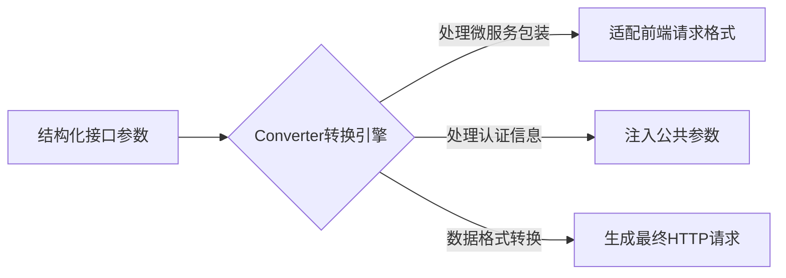

## 自定义接口转换器（Converter）

`aomaker` 框架提供了一个核心组件——`Converter`，专门负责将定义好的接口对象转化为标准的 HTTP 请求格式，以便发起实际的接口调用。

### 请求转换引擎（Converter）介绍


#### 核心职责与处理流程



在实际项目中，尤其是微服务架构或前后端分离场景，通常存在中间层或适配层，对前端发出的请求进行特殊包装、增强或转换处理。这时可能会出现以下情况：

- 前端实际发出的请求（抓包查看）与接口文档中定义的请求结构并不一致。
- 接口定义（尤其自动生成）严格按照接口文档规范进行。

当我们进行系统级集成测试、线上巡检或用户场景模拟测试时，往往更希望直接使用前端请求的格式，而不是接口文档的原始格式。这种情况下，我们就需要通过自定义 `Converter` 来实现特殊请求结构的转换。

### 场景案例对比

- **前端实际请求示例（抓包查看）：**

```python
frontend_request = {  
    "url": "https://aomaker.com/global_api/",  
    "method": "POST",  
    "headers": {"Content-Type": "application/x-www-form-urlencoded"},  
    "params": {"action": "api/containers/usr-xxxx/list"},  
    "data": {  
        "params": {  
            "limit": 10,  
            "offset": 0,  
            "action": "api/containers/usr-xxxx/list",  
            "owner": "usr-xxxx",  
            "service": "k8s"  
        },  
        "method": "GET"  
    }  
}
```

- **后端接口文档定义示例：**

```python
backend_request = {  
    "url": "https://aomaker.com/api/containers/usr-xxxx/list",  
    "method": "GET",  
    "params": {  
        "limit": 10,  
        "offset": 0,  
        "owner": "usr-xxxx",  
    },  
}
```

可以发现：

- 前端请求经过了一定的包装处理，与后端定义有明显差异。
- 若直接使用预置的默认`Converter`，则无法模拟真实的前端请求。

### 如何自定义 Converter

若遇到上述情况，可以通过自定义继承 `RequestConverter`，实现请求的自定义转换逻辑：

1. 在项目目录任意位置新建模块，例如 `apis/base.py`：

```python
import json

from attrs import define, field

from aomaker.core.base_model import PreparedRequest
from aomaker.core.converters import RequestConverter, ContentType
from aomaker.storage import config

@define  
class CustomConverter(RequestConverter):

    @property  
    def common_body(self):  
        return {  
            "owner": config.get('user_id'),  
            "service": "k8s"  
        }

    # 覆盖钩子方法，实现自定义转换逻辑
    def post_prepare(self, prepared_data: PreparedRequest) -> PreparedRequest:  
        url = f"{self.base_url}/global_api/"  
        params = {"action": self.route}  
        
        base_body = prepared_data.request_body.copy() if prepared_data.request_body else {}
        base_body.update(self.common_body)
        base_body['action'] = self.route

        new_body = {  
            "params": json.dumps(base_body),  
            "method": prepared_data.method,  
        }  
          
        # 返回重新包装后的PreparedRequest对象  
        return PreparedRequest(  
            method="POST",  
            url=url,  
            headers=prepared_data.headers,  
            params=params,  
            request_body=new_body,  
            files=prepared_data.files  
        )
```

**注意事项：**

- 自定义转换类需继承自 `aomaker.core.converters.RequestConverter`。
- 方法 `post_prepare` 为父类预留的钩子方法，专为子类自定义转换逻辑使用，方法签名不得修改，仅在方法内部实现转换规则。

### 如何应用自定义的 Converter

定义好自定义转换逻辑后，我们需要确保所有接口都应用这个规则，可通过定义自定义的接口基类并重写其 `converter` 属性实现。

在 `apis/base.py` 中添加：

```python
from attrs import define, field
from aomaker.core.api_object import BaseAPIObject, ResponseT

@define
class CustomBaseAPIObject(BaseAPIObject[ResponseT]):
    converter = field(default=CustomConverter)
```

这样，所有定义的接口类继承 `CustomBaseAPIObject` 后，即自动应用自定义的转换规则。

例如：

```python
@define
@router.get("/api/users")
class GetUsersAPI(CustomBaseAPIObject[UserListResponse]):
    ...
```

> [!tip] 提示  
> 使用 `aomaker gen models` 命令自动生成接口定义时，可使用参数 `--base-api-class` 指定统一继承的接口基类：
> ```bash
> aomaker gen models --base-api-class apis.base.CustomBaseAPIObject
> ```

如此一来，便能灵活且规范地实现项目内统一的请求格式转换。